# Resolução códigos da lista 2 do slide da Aula 13

## Q01 - Crie uma base de dados chamada empresa
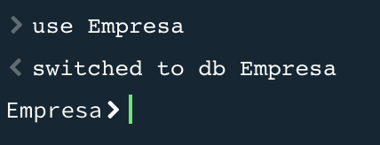

## Q02 - Adicione uma coleção chamada Pessoa
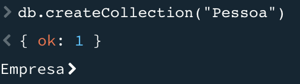

## Q03 - Atribua a cada Documento em Pessoa os seguintes atributos: nome, idade, cargo, cidade.
### 3.1 Faça a atribuição para 10 pessoas;
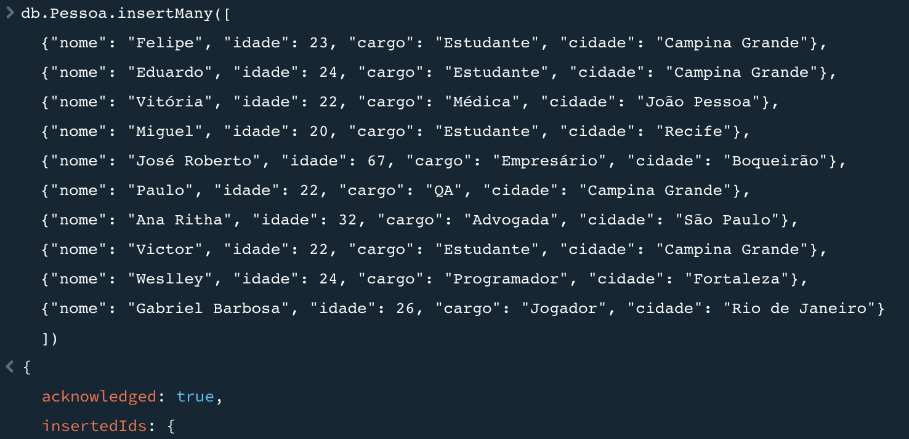

## Q04 - Atualize os dados de duas pessoas, em que faça a complementação do nome e endereço.
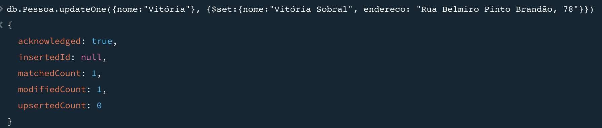
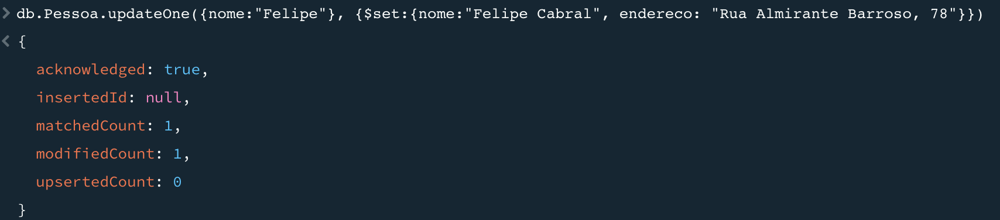

## Q05 - Filtre apenas as pessoas com idade maior que 25 anos, sem apareça o id.
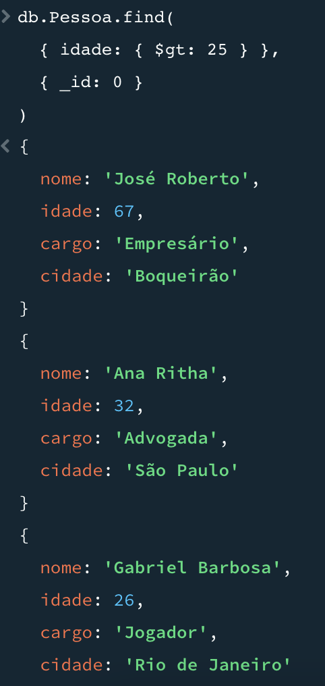

## Q06 - Faça a agregação para calcular a média de idade das pessoas por cidade.
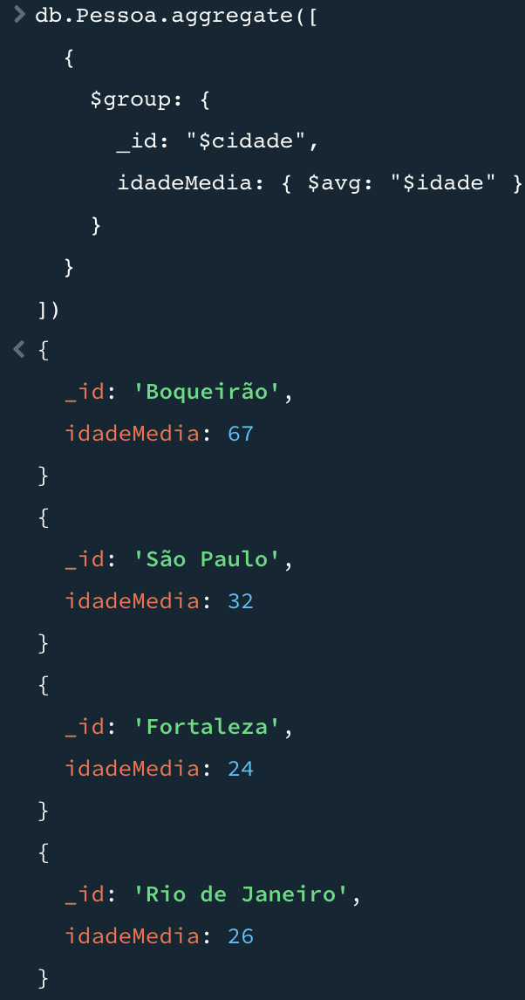

## Crie uma nova coleção dos setores de trabalho, em cada setor deverá constar: sigla, descrição e salário
### 7.1 Faça a inclusão de 4 siglas distintas.
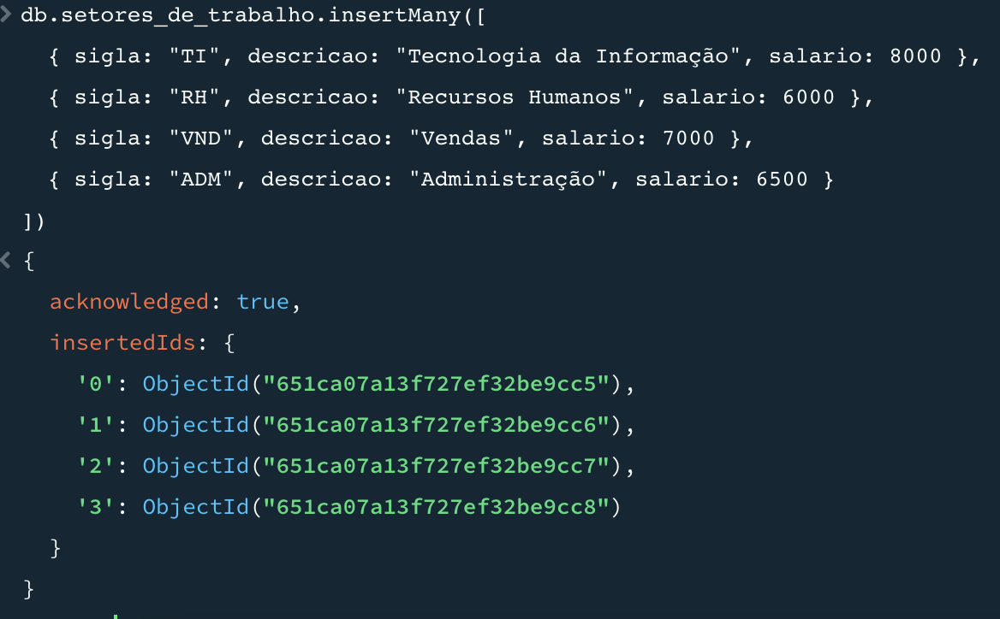

## Q08 - Qual o setor de trabalho com maior salário?
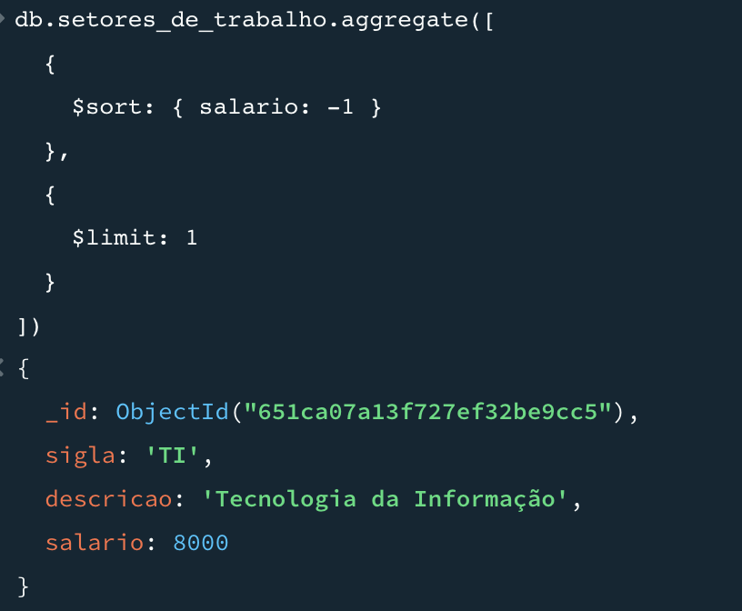

## Q09 - Qual o setor de trabalho com menor salário?
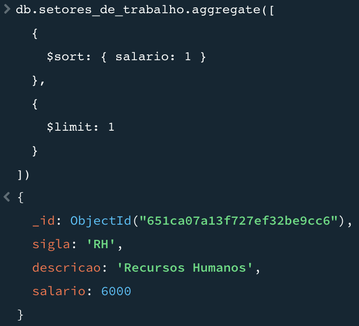

## Q10 - Qual a média dos salários dos setores de trabalho? (Essa EU entendi que era para pegar a média de TODOS os setores, ou seja, eles juntos)
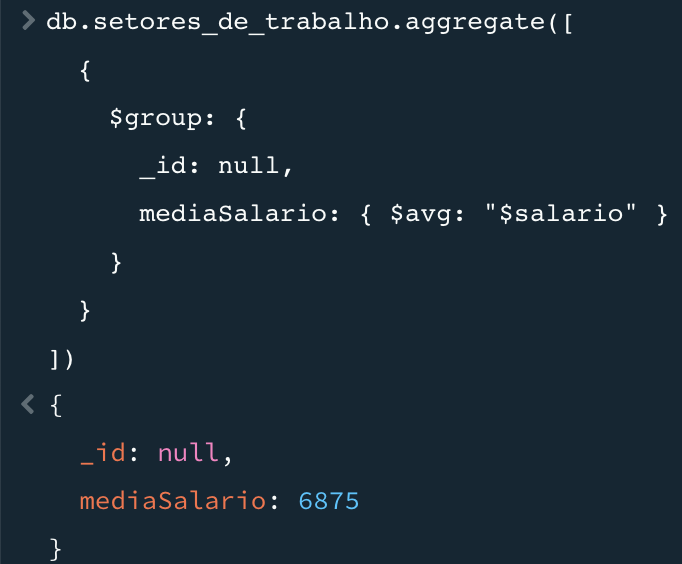
